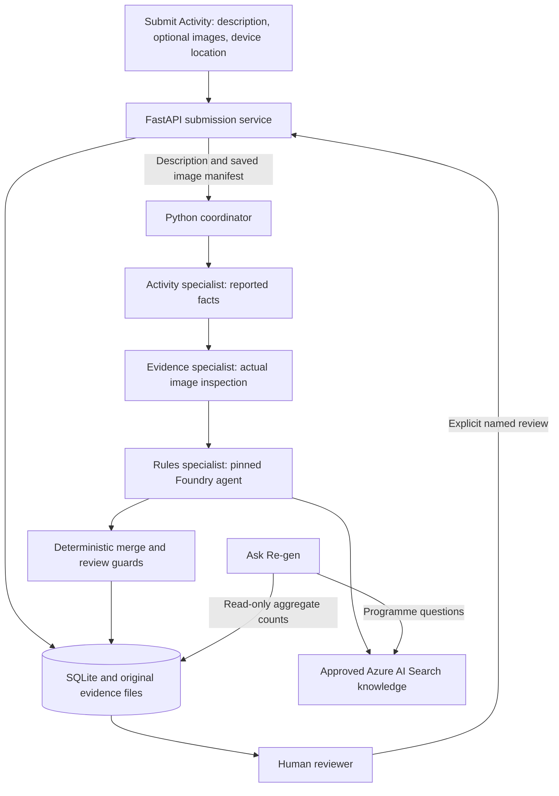

# Re-gen

**A multiagent assistant that prepares environmental activity submissions for human verification.**

Re-gen combines reported field activity, uploaded image evidence, approved programme
knowledge, and an explicit human review workflow. Its purpose is to help a reviewer
understand what was reported, what the supplied evidence shows, which requirements
apply, and what still needs clarification.

The default pipeline coordinates three specialist roles through Microsoft Foundry
and Azure AI Search. A Python coordinator merges their structured findings and
preserves an audit trail. AI recommendations support a person’s decision;
approval and rejection are recorded only through the human review workflow.

## What is implemented

- **Submit Activity:** save a field description, fresh device coordinates, and
  optional image evidence.
- **Multiagent analysis:** extract reported facts, inspect actual image pixels,
  retrieve approved rules, and reconcile the findings.
- **Evidence comparison:** identify visually consistent, unrelated, contradictory,
  or unclear images; mismatched and inconclusive evidence require human review.
- **Review Queue:** inspect source statements, evidence, rule citations,
  missing information, inconsistencies, and specialist traces.
- **Human review:** explicitly confirm Approve, Reject, or Request Clarification
  with a reviewer name and notes.
- **History:** retain source revisions, analysis attempts, image associations,
  specialist findings, and human review events.
- **Ask Re-gen:** answer general questions, retrieve programme knowledge, and
  report fresh local submission counts and activity quantities by reported place
  and human review status.
- **Local persistence:** SQLite stores records and audit history; original images
  are retained separately for reviewers.
- **API and container:** FastAPI exposes the workflow and OpenAPI documentation;
  a non-root Docker image supports a protected demonstration deployment.

## Architecture



### Specialist responsibilities

1. **Activity specialist** extracts only facts explicitly reported in the
   description. Unknown fields remain null. It does not inspect evidence or
   invent programme requirements.
2. **Evidence specialist** inspects normalized copies of supplied images and
   compares visible content with the description. Every uploaded image must have
   exactly one observation. This stage is skipped for text-only submissions.
3. **Rules specialist** uses the existing `regen` Foundry agent, pinned by default
   to version `11`, and its approved Azure AI Search connection. A successful
   retrieval is required before its analysis is accepted.
4. **Coordinator** combines the typed results. It preserves extracted reported
   facts, generates factual image receipts from the server’s image manifest, and
   forces `FLAG_FOR_REVIEW` when specialist facts conflict or image evidence is
   mismatched or inconclusive.

These are bounded specialist calls coordinated by the application, rather than
an autonomous team with unrestricted tools or a Foundry-hosted workflow. Calls
run sequentially. Text analysis normally uses two model calls; image analysis
adds the evidence inspection call. Each provider request has its own timeout.

Completed stage snapshots are saved before the next stage. If a required stage
fails, the attempt fails safely, prior findings and evidence remain available,
and the user can retry. There is no silent fallback to a successful recommendation.

## Review and evidence boundaries

The AI can recommend:

- `READY_FOR_HUMAN_REVIEW`: the analysis has no unresolved finding requiring
  clarification; a person still makes the decision.
- `NEEDS_CLARIFICATION`: required information is missing and a clarification
  question is provided.
- `FLAG_FOR_REVIEW`: missing approved policy, conflicting findings, or uncertain
  evidence requires a reviewer’s attention.

The separate human statuses are `PENDING_REVIEW`, `CLARIFICATION_REQUESTED`,
`APPROVED`, and `REJECTED`. Approval and rejection are final in this prototype.
AI recommendations do not change those statuses or issue Green Merit points,
tokens, payments, or other rewards.

Re-gen distinguishes **evidence reported** from **evidence received**. Saying that
three photos exist does not mean the system inspected them. Only supplied files
become server-owned receipts. Visual consistency does not establish the exact
count, event date, identities, species, location, or survival of trees.

Verification requirements come from the approved Search knowledge. An unknown
activity or missing approved rule is flagged rather than assigned an invented
requirement. The repository’s [development rules](AGENTS.MD) describe these boundaries.

## Technology

- Python 3.12, FastAPI, Uvicorn, and Pydantic.
- Microsoft Foundry through `azure-ai-projects` and the project OpenAI client.
- Azure AI Search for approved programme knowledge.
- `DefaultAzureCredential` for Azure authentication; Search uses an AAD connection.
- SQLite for local records and concurrency checks.
- Pillow for validation, orientation, resizing, and safe vision copies.
- Vanilla HTML, CSS, and JavaScript for the browser interface.
- pytest and executable Node browser checks for regression coverage.

The API pins OpenAI to `>=2.8.0,<3` for compatibility with the current Projects SDK.

## Local setup

### Prerequisites

- Python 3.12 and a supported Azure CLI installation.
- Access to a configured Foundry project, the model deployment, and the approved
  Search connection/index.
- A browser that can obtain geolocation permission for submission.
- Node.js to run the browser regression checks; it is not required to serve the app.

Clone the repository and install the API dependencies:

```bash
git clone https://github.com/braytone-q/foundry-sandbox-1a180a.git
cd foundry-sandbox-1a180a
python3 -m venv .venv
.venv/bin/python -m pip install -r requirements-api.txt
az login
```

For a different Azure project, supply its endpoint and deployment settings before
starting. Values below are placeholders, not resources that this command creates:

```bash
export REGEN_PROJECT_ENDPOINT='https://YOUR-RESOURCE.services.ai.azure.com/api/projects/YOUR-PROJECT'
export REGEN_AGENT_NAME='regen'
export REGEN_AGENT_VERSION='YOUR-TESTED-AGENT-VERSION'
export REGEN_ACTIVITY_MODEL='YOUR-MODEL-DEPLOYMENT'
export REGEN_IMAGE_MODEL='YOUR-VISION-MODEL-DEPLOYMENT'
export REGEN_QUESTION_MODEL='YOUR-QUESTION-MODEL-DEPLOYMENT'
export REGEN_SEARCH_CONNECTION_NAME='YOUR-APPROVED-SEARCH-CONNECTION'
export REGEN_SEARCH_INDEX_NAME='YOUR-APPROVED-SEARCH-INDEX'
```

If continuing in the existing project, retain its working settings and valid
Azure sign-in. The detailed [environment instructions](INSTRUCTIONS.md) explain
the existing connection and tenant setup. The launch script detects the optional
project-local Azure CLI at `.venv/azure-cli/bin` and its `.venv/azure-config` cache,
while respecting an explicitly configured `AZURE_CONFIG_DIR`.

Start the app:

```bash
bash run_api.sh
```

- Browser: <http://127.0.0.1:8000/>
- Interactive API documentation: <http://127.0.0.1:8000/docs>
- OpenAPI schema: <http://127.0.0.1:8000/openapi.json>
- Local readiness: <http://127.0.0.1:8000/api/health>

The default is **multiagent**. To use the earlier single-agent pipeline explicitly:

```bash
REGEN_ANALYSIS_MODE=single_agent bash run_api.sh
```

Use one server process for a database. Startup marks unfinished attempts as
interrupted so they can be retried; running a second server or enabling reload
against the same active database is unsupported. Stop a foreground server with Ctrl+C.

## Configuration

Settings are read from environment variables at startup; the app does not
automatically load a `.env` file.

- `REGEN_ANALYSIS_MODE`: `multiagent` by default; `single_agent` is the supported override.
- `REGEN_PROJECT_ENDPOINT`: Foundry project endpoint; defaults to the existing project.
- `REGEN_AGENT_NAME` / `REGEN_AGENT_VERSION`: default `regen` / `11`.
- `REGEN_ACTIVITY_MODEL`, `REGEN_IMAGE_MODEL`, `REGEN_QUESTION_MODEL`: default deployment `gpt-5-mini`.
- `REGEN_SEARCH_CONNECTION_NAME`: default `regen-verification-search-mi`.
- `REGEN_SEARCH_INDEX_NAME`: default `regen-verification-index`.
- `REGEN_DATABASE_PATH`: default `runtime/regen.sqlite3`; its sibling `evidence/` holds originals.
- `REGEN_REQUEST_TIMEOUT_SECONDS`: default `90`; must be greater than zero and at most `600`.
- `REGEN_PORT`: local launch port; default `8000`.
- `REGEN_ALLOWED_HOSTS`: comma-separated hostnames; defaults to localhost and loopback addresses.
- `REGEN_DEMO_USERNAME` / `REGEN_DEMO_PASSWORD`: paired Basic-auth credentials for a protected demo.

Public host configuration requires both demo credentials. These credentials
protect the entire demo, rather than providing separate submitter/verifier accounts.

## Using the interface

1. Open **Submit Activity**, describe what happened, and optionally select images.
2. Submit and allow fresh browser geolocation. A failed location capture preserves
   the draft and blocks saving until a successful fix is available.
3. Open the saved record and compare reported facts with visible image observations,
   approved-rule findings, and the expandable multiagent trace.
4. Supply clarification as a new source revision when required. A revision replaces
   the description while retaining history and existing image associations.
5. If a provider call failed, use **Retry Analysis**. The saved revision and its
   evidence are reused, and a new attempt is added.
6. Record a human review with a reviewer name and notes, then explicitly confirm
   the action. Review requires a successful latest analysis for the current revision.

Images are limited to 20 non-animated JPEG, PNG, or WebP files per activity,
at most 8 MiB each. Original bytes are retained. Vision copies are oriented,
resized to fit 1600 × 1600, converted to JPEG, and stripped of EXIF metadata.

Device latitude, longitude, accuracy, and capture time are retained separately
from the reported activity place. New submissions/revisions require a timezone-aware
fix no older than five minutes and no more than 30 seconds in the future. Device
coordinates are provenance, not attested proof of an event site, and are not sent
to the AI services.

## Ask Re-gen and saved activity counts

Ask Re-gen supports everyday questions, project questions, and grounded programme
questions. Recent page-session conversation is sent with each question; **New
conversation** or a reload clears that chat context.

It receives fresh read-only aggregates of local review statuses and reported
activity quantities grouped by activity type, reported place, and human status.
For example, if the database contains a human-approved report of 300 trees at
Nanyuki, it can answer “300 trees from one human-approved report.” This example
is not a seeded dataset included in the repository.

Totals use only the latest current-revision analysis per submission, so retries
and old revisions do not inflate counts. Pending, clarification-requested, and
rejected reports remain separate from approved reports. Missing or negative
quantities are unquantified; an absent matching record does not prove zero
planting. These are local reported totals, not all activity in a town.

Aggregate context excludes source descriptions, reviewer notes, actual images,
and device coordinates. Reported place labels are included as untrusted data.
Programme-policy questions retrieve approved Search knowledge; general and local
count questions do not acquire unrelated programme citations. This configuration
does not provide live web, news, or weather lookup.

## API overview

The browser and API use the same services and validation rules:

- `GET /api/health`: local readiness without an Azure inference call.
- `GET /api/submissions`: paginated/filterable records; default scope is the active review queue.
- `GET /api/submissions/{id}`: source, attempts, evidence, and human history.
- `POST /api/submissions`: create a description with required device location.
- `POST /api/submissions/with-images`: create using multipart description, location JSON, and files.
- `POST /api/submissions/{id}/revisions`: replace the reported description with a fresh device fix.
- `POST /api/submissions/{id}/revisions/with-images`: revise and append image evidence.
- `POST /api/submissions/{id}/analyze`: retry the saved current revision.
- `POST /api/submissions/{id}/reviews`: record an explicitly requested human action.
- `GET /api/images/{id}`: retrieve a retained original.
- `POST /api/questions`: read-only Q&A with optional complete conversation pairs.

Example read-only requests:

```bash
curl http://127.0.0.1:8000/api/health
curl 'http://127.0.0.1:8000/api/submissions?status=ALL&limit=25&offset=0'
curl http://127.0.0.1:8000/api/questions \
  -H 'Content-Type: application/json' \
  -d '{"question":"How many trees are recorded as planted in Nanyuki?"}'
```

Create/revision bodies contain a `description` and `device_location` object with
`latitude`, `longitude`, `accuracy_m`, `captured_at`, and
`source: "browser_geolocation"`. Use the browser to capture actual field coordinates.
Revision, retry, and review mutations also require the current integer
`expected_version`; stale versions return a conflict instead of repeating an action.
Review inputs specify `action`, `reviewer_name`, and `notes`.

The final AI analysis keeps this 14-field contract:

```json
{
  "activity_type": null,
  "quantity": null,
  "species": null,
  "species_category": null,
  "activity_date": null,
  "location": null,
  "community_group": null,
  "evidence_reported": [],
  "evidence_received": [],
  "missing_information": [],
  "inconsistencies": [],
  "recommendation": "FLAG_FOR_REVIEW",
  "reason": "Illustrative output only; no activity has been analyzed.",
  "clarification_question": null
}
```

Attempt metadata separately includes safe failure information, citations, image
assessments, device-location snapshots, and the optional orchestration trace.

## Tests and validation

```bash
.venv/bin/python -m pip install -r requirements-dev.txt
.venv/bin/python -m pytest -q
node --check regen_api/static/app.js
bash -n run_api.sh
```

The latest full regression run passed **226 tests**. Tests exercise real temporary
SQLite databases and substitute external AI responses. Coverage includes strict
contracts, grounding, image inspection, canonical receipts, device location,
human authority, optimistic concurrency, revisions/retries, migrations, partial
traces, Q&A aggregates, and executable browser behavior.

Live Azure smoke tests separately exercised text and synthetic image multiagent
analysis. An unrelated synthetic image produced `MISMATCH` and `FLAG_FOR_REVIEW`;
no human approval was created. The exact Nanyuki count question and follow-up were
also validated against the running local records.

- [Multiagent validation and review](docs/superpowers/2026-10-08-regen-multiagent-validation.md)
- [Saved activity-count validation and review](docs/superpowers/2026-10-08-regen-activity-count-validation.md)
- [Multiagent architecture spec](docs/superpowers/specs/2026-10-08-regen-multiagent-design.md)
- [Implementation plan](docs/superpowers/plans/2026-10-08-regen-multiagent.md)

Live acceptance checks for a deliberately selected Foundry agent version are
available through `python verify_agent.py --version YOUR-VERSION`. That command
invokes Azure model calls; it is separate from offline pytest coverage.

## Repository guide

```text
regen_api/
  main.py          HTTP routes and request boundaries
  service.py       Saved submission and review workflows
  store.py         SQLite history, evidence links, and read-only aggregates
  settings.py      Environment configuration
  schemas.py       Strict request, analysis, trace, and response contracts
  foundry.py       Foundry client, grounding checks, and gateway dispatch
  activity.py      Reported-fact specialist
  vision.py        Actual image inspection and image review guards
  orchestration.py Specialist sequence and deterministic merge
  questions.py     General, project, and programme Q&A
  images.py        Upload validation and original-image storage
  static/          Browser interface, evidence picker, and location capture
data/              Approved-rule source document used by setup scripts
tests/             Python regressions and executable Node browser checks
docs/superpowers/  Design, implementation, validation, and review records
run_api.sh         Local one-process launch
Dockerfile         Non-root container build
INSTRUCTIONS.md    Detailed existing environment and deployment runbook
AGENTS.MD          Project authority and evidence rules
```

`connect_search_agent.py` creates a new Search-enabled agent version;
`provision_kb.py` creates/uploads the Search index contents. These are explicit
cloud configuration operations, not startup requirements for an already configured
project. Validate a new agent version before changing the API pin. The older
`configure_regen_agent.py` is a historical bootstrap example with an earlier
evidence schema; it is not the current API setup path. `run_agent.py` is a direct
single-agent CLI example, separate from the browser’s default coordinator.

## Container demonstration and persistence

```bash
docker build -t regen-api .
```

The container runs as user `10001`, listens on port 8000, and uses
`/data/regen.sqlite3`. Mount persistent storage at `/data` with permissions for
that user, and run one replica. Cloud use requires an identity that can invoke
Foundry and access the configured Search connection. Configure the allowed
hostname and demo credentials through the hosting service’s secret/settings
mechanism. Serve a remote browser demonstration over HTTPS so geolocation and
credential transport work appropriately.

The [Azure Container Apps runbook](INSTRUCTIONS.md#temporary-password-protected-class-demo-azure-container-apps)
describes a protected class demonstration. A Dockerfile is provided; no public
deployment is implied by this repository.

Back up the SQLite database and its sibling evidence directory with the server
stopped. Restore them together so image references still resolve. Runtime records,
original evidence, virtual environments, authentication caches, `.env` files, and
logs are excluded from Git. Pushing source code does not back up field submissions.

## Presentation and demo outline

Use the architecture diagram and the following sequence to explain the project:

1. **Problem:** conservation reports need consistent, evidence-aware preparation
   before a human can review them.
2. **Workflow:** move from reported activity through specialists to a single
   structured review report.
3. **Grounding:** show how approved Search knowledge supplies requirements and
   how unknown rules are flagged.
4. **Evidence:** demonstrate a clearly labeled synthetic mismatch and compare the
   reported claim with the visible image observation.
5. **Human control and audit:** show the specialist trace, retained source history,
   and explicit review confirmation; explain that AI does not grant approval.
6. **Local reporting:** ask for a location-based planting total and distinguish
   human-approved from pending reports.
7. **Validation and next steps:** present the test evidence, then distinguish the
   current prototype from future production work.

Use synthetic activities for demonstrations and name them clearly in the source.
For a controlled offline UI demonstration, launch the dedicated test fixture on a
separate port with its own database:

```bash
.venv/bin/python -m uvicorn tests.browser_fixture:create_app --factory \
  --host 127.0.0.1 --port 8001
```

That fixture supplies controlled single-agent results for browser QA; it does not
demonstrate live Azure multiagent reasoning. The normal production path does not
fallback to those test results.

## Current scope and future work

This is a trusted single-operator prototype. Reviewer names are operator assertions,
not authenticated individual identities. The protected-demo password is not a
role-based account system. It does not provide automatic verification, reward
issuance, shared multi-replica database operation, or background job scheduling.

Potential production work includes authenticated roles, a managed shared data
store, asynchronous processing, clearer operational monitoring, and programme-
specific evidence validation. These are future directions, not implemented claims.
The activity-count review also records nonblocking follow-ups for a shared capture
transaction and additional direct status-boundary tests.
